# VICAS Hub — Full-Stack Research Lab Portal

> **VLSI Circuits and Systems Lab — IIIT-Delhi**
> A production-grade research lab web platform for managing projects, news, achievements, photo gallery, BTP reports, and a Resume Knowledge Graph. Built with **React + Express + SQLite** and deployed on **AWS EC2 + Vercel**.

**🌐 Live**: [https://vicas-lab.vercel.app](https://vicas-lab.vercel.app)

---

## 📸 Screenshots

### Home Page
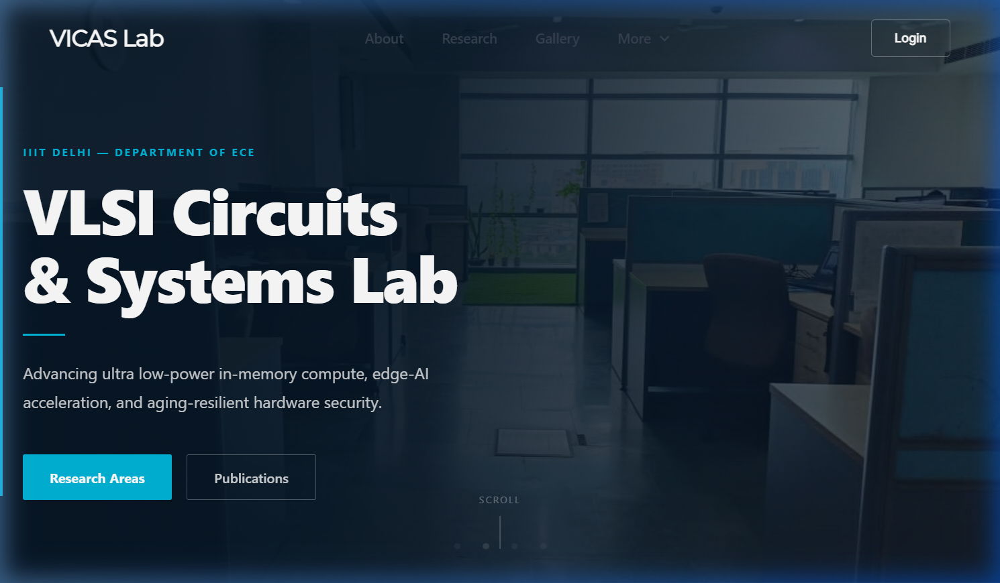

### About Page
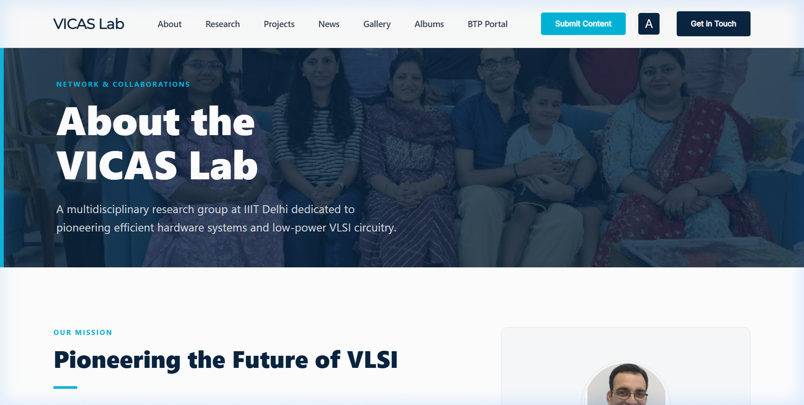

### Research Areas
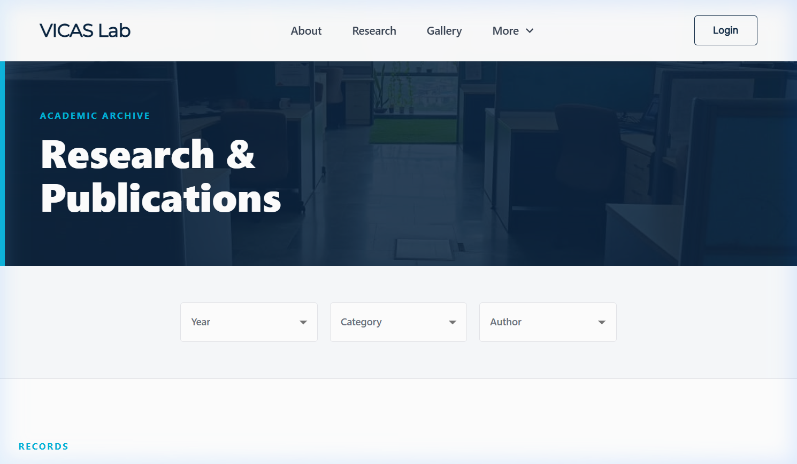

### Projects Grid
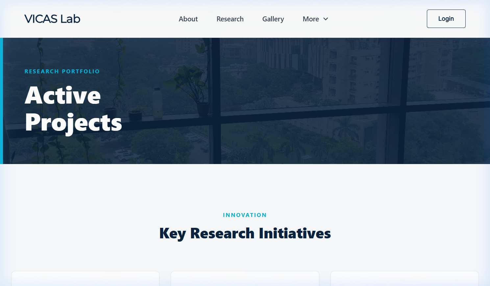

### Project Detail Modal
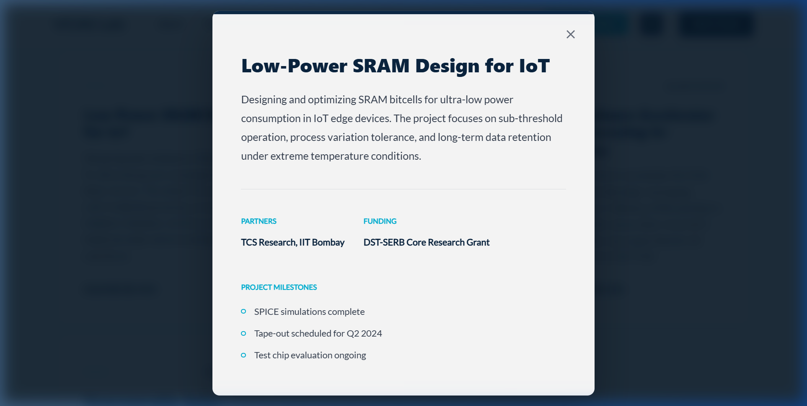

### News & Achievements
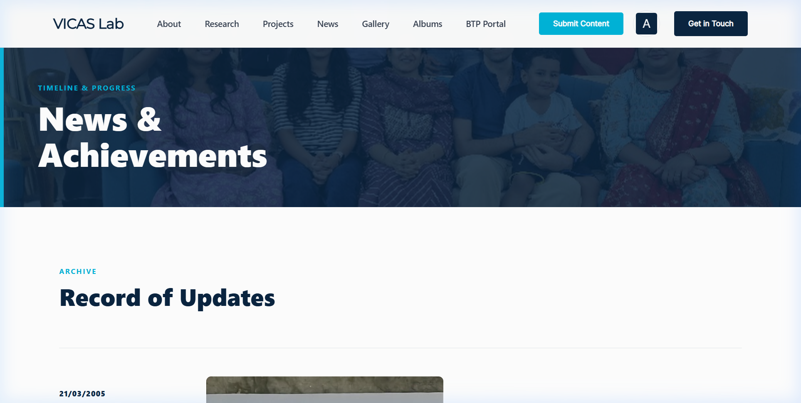

### Photo Gallery
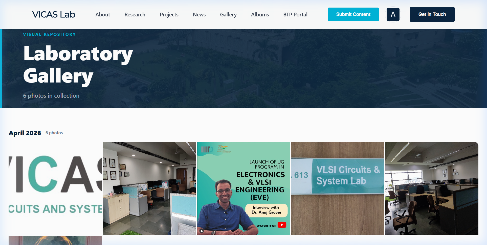

### Albums
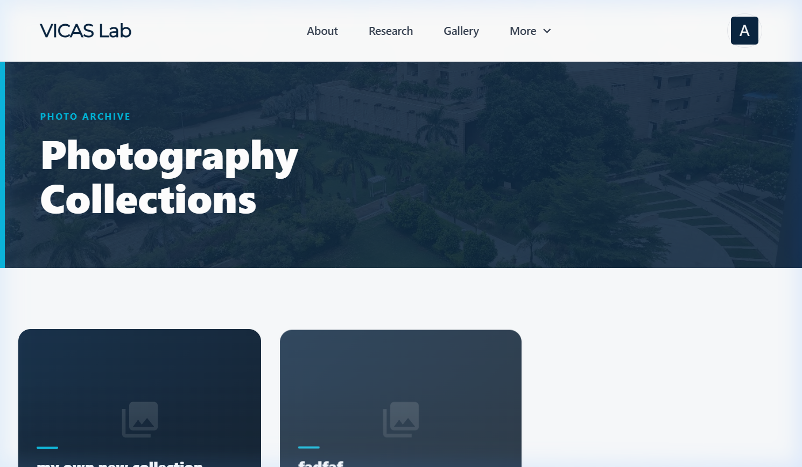

### Contact Page
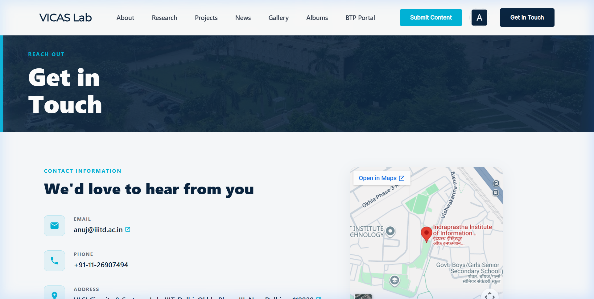

### Admin — User Management
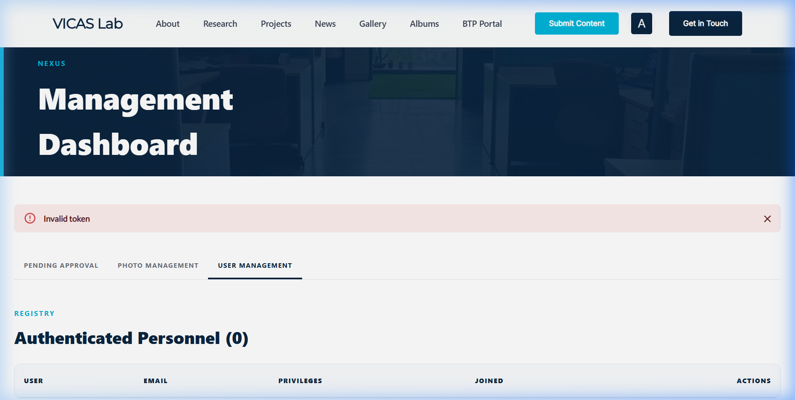

### Content Submission Form
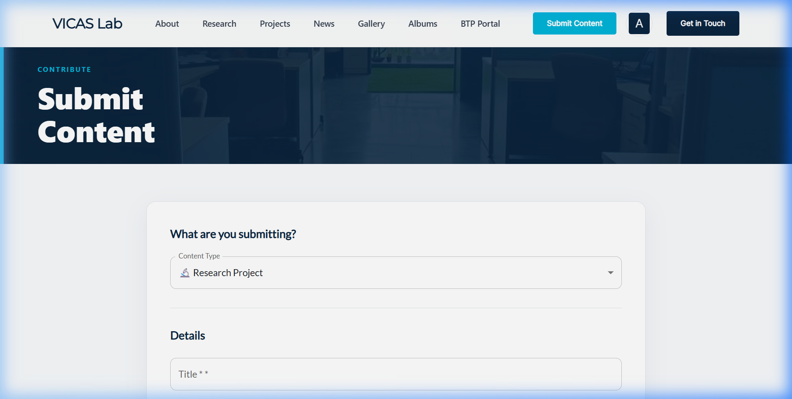

### Photo Upload
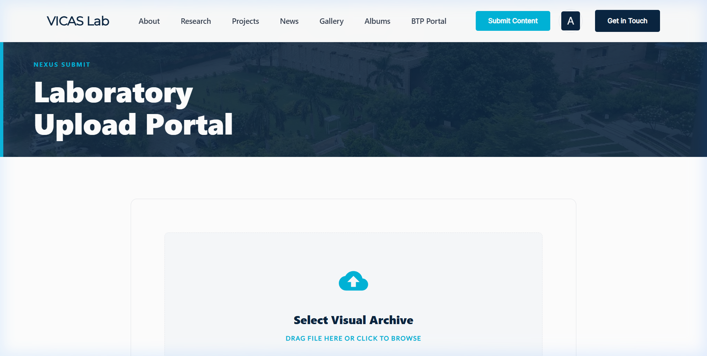

### BTP Portal
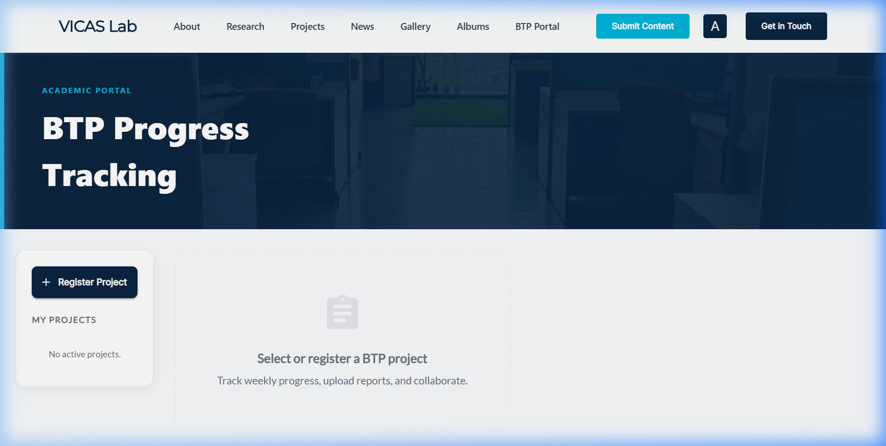

---

## 🧭 Table of Contents

- [Tech Stack](#tech-stack)
- [System Architecture](#system-architecture)
- [Features](#features)
- [Project Structure](#project-structure)
- [Database Schema](#database-schema)
- [API Reference](#api-reference)
- [Resume Knowledge Graph (Sub-project)](#resume-knowledge-graph)
- [Deployment — What We Did](#deployment--what-we-did)
- [Local Development](#local-development)
- [Seed Data](#seed-data)

---

## Tech Stack

| Layer | Technology |
|-------|-----------|
| **Frontend** | React 19, React Router v7, Material UI (MUI v7) |
| **Backend** | Node.js, Express.js 4 |
| **Database** | SQLite 3 (via `sqlite` + `sqlite3` npm packages) |
| **Auth** | JWT (Access + Refresh Token rotation), Google OAuth via Firebase Admin SDK |
| **File Storage** | Local disk (`server/uploads/`) served statically via Express |
| **Security** | Custom security headers (X-Content-Type-Options, HSTS, etc.), CORS whitelist, express-rate-limit, bcrypt (12 rounds) |
| **Email** | Nodemailer + Gmail SMTP (for BTP invite emails & weekly cron reminders) |
| **Cron** | `node-cron` — weekly BTP report reminder emails every Sunday 9 AM |
| **Process Manager** | PM2 (production) |
| **Reverse Proxy** | Nginx on EC2 |
| **Frontend Hosting** | Vercel (auto-deploy from GitHub) |
| **Backend Hosting** | AWS EC2 `t2.micro` (Ubuntu) |
| **DNS** | DuckDNS (`vicas-hub.duckdns.org`) for stable backend URL |

---

## System Architecture

```
┌──────────────────────────────────────────────────────────┐
│                     USERS (Browser)                       │
│                  https://vicas-lab.vercel.app              │
└──────────────────────┬───────────────────────────────────┘
                       │
                       ▼
┌──────────────────────────────────────────────────────────┐
│                  VERCEL (Frontend)                         │
│  React 19 + MUI v7 — Static SPA build                     │
│  vercel.json rewrites /api/* → EC2 backend                │
└──────────────────────┬───────────────────────────────────┘
                       │  HTTPS → HTTP proxy
                       ▼
┌──────────────────────────────────────────────────────────┐
│              AWS EC2 t2.micro (Backend)                    │
│  ┌─────────────────────────────────────────────────────┐  │
│  │  Nginx (port 80) → reverse proxy → localhost:4000   │  │
│  └─────────────────────────┬───────────────────────────┘  │
│                            ▼                               │
│  ┌─────────────────────────────────────────────────────┐  │
│  │  PM2 → node index.js (Express on port 4000)         │  │
│  │  ├── /api/auth     — JWT + Google OAuth              │  │
│  │  ├── /api/gallery  — Photo CRUD + Albums             │  │
│  │  ├── /api/content  — Projects/News/Achievements      │  │
│  │  ├── /api/btp      — BTP Portal (reports, invites)   │  │
│  │  ├── /api/upload   — File upload endpoint            │  │
│  │  └── /uploads/*    — Static file serving             │  │
│  └─────────────────────────┬───────────────────────────┘  │
│                            ▼                               │
│  ┌─────────────────────────────────────────────────────┐  │
│  │  SQLite DB (server/data/db.sqlite)                   │  │
│  │  Local uploads (server/uploads/)                     │  │
│  └─────────────────────────────────────────────────────┘  │
│                                                            │
│  ┌─────────────────────────────────────────────────────┐  │
│  │  Firebase Admin SDK                                  │  │
│  │  → Google OAuth token verification                   │  │
│  │  → Firebase Storage (optional image hosting)         │  │
│  └─────────────────────────────────────────────────────┘  │
└──────────────────────────────────────────────────────────┘

┌──────────────────────────────────────────────────────────┐
│         Resume Knowledge Graph (Separate Service)         │
│  Python FastAPI on port 8001 (Docker container)           │
│  ├── AWS Bedrock (Claude 3.5 + Titan Embeddings)          │
│  ├── FAISS vector index (cosine similarity search)        │
│  └── Vite React frontend (embedded)                       │
└──────────────────────────────────────────────────────────┘
```

---

## Features

### 🔐 Authentication
- Email/password registration and login with bcrypt hashing
- **Google OAuth** (Sign in with Google via Firebase Admin SDK)
- JWT access tokens (15 min expiry) + HttpOnly refresh token cookies (7-day rotation)
- Automatic super admin role assignment from a hardcoded email allowlist

### 👥 3-Tier Role System

| Role | Who | Permissions |
|------|-----|-------------|
| **Student** (`user`) | Any registered user | View all content, upload photos (pending approval), submit projects/news/achievements, request Admin role |
| **Admin** (`admin`) | Promoted by Super Admin | All Student perms + approve/reject photos, manage albums, delete content |
| **Super Admin** (`super_admin`) | Pre-configured emails | All Admin perms + manage users (change roles, delete), approve admin requests |

### 📸 Photo Gallery & Albums
- Upload photos → pending queue → admin approval workflow
- Organize into albums; full-screen lightbox navigation
- Base64 upload with local disk storage

### 🔬 Research Projects
- Dynamic project cards fetched from DB (not hardcoded)
- Detail modal: collaborators, funding, milestones, external links, PDF papers

### 📰 News & Achievements
- Combined chronological feed with type badges (📰 News / 🏆 Achievement)
- Each item supports image, PDF attachment, and external link

### ✍️ Content Submission (`/submit`)
- Any logged-in user can submit Research Projects, News, or Achievements
- Rate-limited to 10 submissions per hour
- Optional image, PDF, and external URL attachments

### 📋 BTP Portal (`/btp`)
- Create BTP projects with member management
- Weekly report uploads (text + file attachments)
- Per-report comments with threaded discussion
- Project privacy toggle (owner-only control)
- Email invitations for unregistered users (via Nodemailer)
- **Automated weekly cron reminders** every Sunday 9 AM

### 🛡️ Admin Panel (`/admin`)
- **Tab 1**: Pending photo approval queue
- **Tab 2**: Photo & album management
- **Tab 3** *(Super Admin)*: User management, role changes, admin request processing

---

## Project Structure

```
vicas-hub/
├── src/                              # React frontend (CRA)
│   ├── components/
│   │   ├── common/
│   │   │   ├── Header.js             # Nav bar, login/logout, role-aware menu
│   │   │   ├── Footer.js             # Site footer
│   │   │   ├── LoginDialog.js        # Email + Google OAuth login modal
│   │   │   └── ProtectedRoute.js     # Role-based route guard
│   │   └── pages/
│   │       ├── HomePage.js           # Hero, stats, research highlights
│   │       ├── AboutPage.js          # Lab overview, faculty cards
│   │       ├── ResearchPage.js       # Research areas overview
│   │       ├── ProjectsPage.js       # Live project cards from DB
│   │       ├── NewsPage.js           # News + achievements feed
│   │       ├── GalleryPage.js        # Photo gallery with lightbox
│   │       ├── AlbumsPage.js         # Photo albums
│   │       ├── GalleryUpload.js      # Photo upload form
│   │       ├── ContentUpload.js      # Project/News/Achievement form
│   │       ├── AdminPanel.js         # Full admin dashboard (3 tabs)
│   │       ├── BTPPortal.js          # BTP project & report management
│   │       ├── InvitePage.js         # BTP invite acceptance page
│   │       └── ContactPage.js        # Contact info + Google Map
│   ├── contexts/
│   │   └── AuthContext.js            # JWT auth state, role helpers
│   ├── firebase.js                   # Firebase client config
│   ├── theme.js                      # MUI theme customization
│   └── App.js                        # Routes + layout
│
├── server/                           # Express backend
│   ├── controllers/
│   │   ├── authController.js         # Register, login, refresh, Google OAuth
│   │   ├── galleryController.js      # Photo CRUD + albums + user management
│   │   ├── contentController.js      # Projects/News/Achievements CRUD
│   │   ├── btpController.js          # BTP projects, reports, invites, comments
│   │   └── uploadController.js       # Generic file upload handler
│   ├── routes/
│   │   ├── auth.js, gallery.js, content.js, btp.js, uploadRoutes.js
│   ├── middleware/
│   │   └── auth.js                   # authenticateToken + requireRole
│   ├── utils/
│   │   └── email.js                  # Nodemailer transporter config
│   ├── deploy/
│   │   ├── setup-gce.sh             # Full GCE VM setup script
│   │   ├── update-server.sh         # Git pull + PM2 restart
│   │   ├── nginx-vicas.conf         # Nginx reverse proxy config
│   │   └── migrate-data.sh          # Data migration helper
│   ├── uploads/                     # Stored files (photos, PDFs, BTP reports)
│   ├── data/
│   │   └── db.sqlite                # SQLite database (gitignored)
│   ├── db.js                        # Schema init + migrations
│   ├── index.js                     # Express app entry point
│   ├── cron.js                      # Weekly BTP reminder cron job
│   └── seed.js                      # Sample data seeder
│
├── documentation_screenshots/       # 13 annotated screenshots
├── scripts/
│   ├── seed_research.js             # Research data seeder
│   └── test_email.js                # Email config tester
├── vercel.json                      # Vercel rewrites (proxy /api → EC2)
├── package.json                     # Frontend dependencies
└── .gitignore
```

---

## Database Schema

### `users`
```sql
id TEXT PRIMARY KEY, name TEXT, email TEXT UNIQUE,
password_hash TEXT, refresh_token TEXT,
role TEXT DEFAULT 'user',        -- 'user' | 'admin' | 'super_admin'
created_at DATETIME
```

### `photos`
```sql
id TEXT PRIMARY KEY, image_url TEXT, storage_path TEXT,
title TEXT, description TEXT, uploaded_by TEXT,
uploader_name TEXT, uploader_email TEXT,
status TEXT DEFAULT 'pending',   -- 'pending' | 'approved' | 'rejected'
created_at, updated_at
```

### `albums` + `album_photos`
Many-to-many junction for organizing photos into named collections.

### `content_items`
```sql
id TEXT PRIMARY KEY,
type TEXT NOT NULL,              -- 'project' | 'news' | 'achievement'
title TEXT, description TEXT,
image_url TEXT, storage_path TEXT,
metadata TEXT,                   -- JSON blob: tag, collaborators, funding, milestones, etc.
uploaded_by TEXT, status TEXT DEFAULT 'pending',
created_at, updated_at
```

### `btp_projects`
```sql
id TEXT PRIMARY KEY, title TEXT, owner_id TEXT,
is_public BOOLEAN DEFAULT 0, created_at DATETIME
```

### `btp_members` / `btp_reports` / `btp_invites` / `btp_comments`
Full BTP lifecycle: membership, weekly reports with file attachments, email invites, and threaded comments.

### `admin_requests`
Tracks user requests for admin promotion.

---

## API Reference

### Auth (`/api/auth`)

| Method | Endpoint | Description |
|--------|----------|-------------|
| `POST` | `/register` | Register with email + password |
| `POST` | `/login` | Login → access token + refresh cookie |
| `POST` | `/refresh` | Refresh access token |
| `POST` | `/logout` | Clear session |
| `GET` | `/me` | Current user info |
| `POST` | `/google` | Google OAuth login |

### Gallery (`/api/gallery`)

| Method | Endpoint | Auth | Description |
|--------|----------|------|-------------|
| `POST` | `/upload` | User | Upload photo (base64) |
| `GET` | `/photos` | — | All approved photos |
| `GET` | `/pending` | Admin | Pending photos queue |
| `POST` | `/approve/:id` | Admin | Approve photo |
| `POST` | `/reject/:id` | Admin | Reject & delete photo |
| `GET` | `/albums` | — | List albums |
| `POST` | `/albums` | Admin | Create album |
| `GET` | `/users` | Super Admin | List all users |
| `PUT` | `/users/:id/role` | Super Admin | Change user role |
| `DELETE` | `/users/:id` | Super Admin | Delete user |

### Content (`/api/content`)

| Method | Endpoint | Auth | Description |
|--------|----------|------|-------------|
| `GET` | `/:type` | — | Get items by type (`project`/`news`/`achievement`) |
| `POST` | `/upload` | User | Submit new content (rate-limited: 10/hr) |
| `POST` | `/approve/:id` | Admin | Approve pending item |
| `DELETE` | `/:id` | Admin | Delete item |

### BTP Portal (`/api/btp`)

| Method | Endpoint | Auth | Description |
|--------|----------|------|-------------|
| `POST` | `/projects` | User | Create BTP project |
| `GET` | `/projects` | User | Get user's projects (admins see all) |
| `POST` | `/projects/:id/members` | Owner | Add member by email (sends invite) |
| `POST` | `/projects/:id/invite/accept` | User | Accept email invite |
| `POST` | `/projects/:id/reports` | Member | Upload weekly report |
| `GET` | `/projects/:id/reports` | Member | Get project reports |
| `PUT` | `/projects/:id/privacy` | Owner | Toggle public/private |
| `GET` | `/projects/:id/comments` | Member | Get comments for a week |
| `POST` | `/projects/:id/comments` | Member | Add comment |

---

## Resume Knowledge Graph

A separate sub-project that parses student resumes using AI, builds a FAISS vector index, and provides semantic search with LLM re-ranking.

### Architecture

| Component | Technology |
|-----------|-----------|
| **Parser** | Python + AWS Bedrock (Amazon Nova Micro) — 5-call pipeline per resume |
| **Embeddings** | Amazon Titan Text Embeddings V2 (1024-dim) |
| **Vector DB** | FAISS (IndexFlatIP — cosine similarity) |
| **Search API** | FastAPI (Python) on port 8001 |
| **Re-ranking** | Claude 3.5 Sonnet via Bedrock Converse API |
| **Frontend** | Vite + React (pages: Dashboard, Search, Profile, Graph, Upload) |
| **Deployment** | Docker container on EC2 |

### Pipeline (5 API Calls per Resume)
1. **Basic Info** — Name, email, phone, URLs, college, branch, CGPA
2. **Education** — UG/PG/PhD details, awards, certifications, POR
3. **Marks & Ranks** — 10th/12th marks, JEE/GATE ranks
4. **Experience** — Projects, independent research, work experience, papers
5. **Scoring** — 30 technical skill scores (0-10), soft skills, domain classification

### Key Files
| File | Purpose |
|------|---------|
| `resume_parser.py` | 5-call LLM pipeline, PDF text extraction, auto-indexing |
| `resume_indexer.py` | Batch FAISS index builder from parsed JSONs |
| `resume_search.py` | CLI semantic search with LLM re-ranking |
| `merge_manual.py` | Merges LinkedIn-exported data into parsed profiles |
| `backend/main.py` | FastAPI server (search, upload, graph, stats endpoints) |
| `Dockerfile` | Multi-stage build (Node for frontend, Python for backend) |
| `docker-compose.yml` | Container orchestration with volume persistence |
| `deploy.sh` | EC2 one-command deployment script |

---

## Deployment — What We Did

This section documents every step we ran to get both services live in production.

### Part 1: VICAS Hub (React + Express)

#### 1.1 — Frontend on Vercel

```bash
# 1. Pushed code to GitHub (github.com/ad4rush/Vicas-Lab)
git add . && git commit -m "production build" && git push origin main

# 2. Connected repo on vercel.com
#    Framework Preset: Create React App
#    Root Directory: /
#    Build Command: npm run build (auto-detected)

# 3. Set environment variables on Vercel dashboard:
#    REACT_APP_API_BASE = https://vicas-hub.duckdns.org
#    REACT_APP_GOOGLE_CLIENT_ID = <google_oauth_client_id>

# 4. Deployed — available at https://vicas-lab.vercel.app
```

The `vercel.json` proxies API calls to the backend:
```json
{
  "rewrites": [
    { "source": "/api/(.*)", "destination": "https://vicas-hub.duckdns.org/api/$1" },
    { "source": "/uploads/(.*)", "destination": "https://vicas-hub.duckdns.org/uploads/$1" }
  ]
}
```

#### 1.2 — Backend on AWS EC2

```bash
# 1. Launched EC2 instance
#    AMI: Ubuntu 22.04 LTS
#    Instance type: t2.micro (Free Tier)
#    Storage: 30 GB gp3
#    Security Group: SSH (22), HTTP (80), HTTPS (443), Custom TCP (4000)
#    Key pair: device.pem

# 2. SSH into the instance
ssh -i device.pem ubuntu@<EC2_PUBLIC_IP>

# 3. System setup
sudo apt update -y && sudo apt upgrade -y
curl -fsSL https://deb.nodesource.com/setup_20.x | sudo -E bash -
sudo apt install -y nodejs git nginx

# 4. Install PM2
sudo npm install -g pm2

# 5. Clone the repo
cd /opt
sudo git clone https://github.com/ad4rush/Vicas-Lab.git vicas-hub
sudo chown -R ubuntu:ubuntu /opt/vicas-hub

# 6. Install backend dependencies
cd /opt/vicas-hub/server
npm install --production

# 7. Create data & upload directories
mkdir -p data uploads/gallery uploads/content uploads/pdfs uploads/pending uploads/btp

# 8. Copied Firebase service account JSON
# (from local machine):
scp -i device.pem firebase-service-account.json ubuntu@<IP>:/opt/vicas-hub/server/

# 9. Seeded sample data
node seed.js
# → 4 projects, 3 news items, 3 achievements

# 10. Started with PM2
pm2 start index.js --name vicas-backend
pm2 save
pm2 startup   # followed printed command for auto-start on reboot

# 11. Configured Nginx reverse proxy
sudo tee /etc/nginx/sites-available/vicas-hub > /dev/null << 'NGINX'
server {
    listen 80;
    server_name _;
    client_max_body_size 50M;

    location / {
        proxy_pass http://127.0.0.1:4000;
        proxy_http_version 1.1;
        proxy_set_header Upgrade $http_upgrade;
        proxy_set_header Connection 'upgrade';
        proxy_set_header Host $host;
        proxy_set_header X-Real-IP $remote_addr;
        proxy_set_header X-Forwarded-For $proxy_add_x_forwarded_for;
        proxy_set_header X-Forwarded-Proto $scheme;
        proxy_cache_bypass $http_upgrade;
    }
}
NGINX

sudo ln -sf /etc/nginx/sites-available/vicas-hub /etc/nginx/sites-enabled/
sudo rm -f /etc/nginx/sites-enabled/default
sudo nginx -t && sudo systemctl restart nginx && sudo systemctl enable nginx

# 12. Set up DuckDNS for stable domain
#     Configured vicas-hub.duckdns.org → EC2 public IP
#     Cron job to auto-update IP every 5 minutes

# 13. Verified
curl http://vicas-hub.duckdns.org/
# → {"ok":true}

# 14. Updated Google OAuth authorized origins:
#     Added https://vicas-lab.vercel.app and http://vicas-hub.duckdns.org
```

#### 1.3 — Updating After Code Changes

```bash
# SSH into EC2
ssh -i device.pem ubuntu@<EC2_IP>

# Pull and restart
cd /opt/vicas-hub
git pull origin main
cd server && npm install --production
pm2 restart vicas-backend

# Or use the automated script:
sudo /opt/vicas-hub/server/deploy/update-server.sh
```

---

### Part 2: Resume Knowledge Graph (Python + FastAPI + Docker)

#### 2.1 — Parsing All Resumes

```bash
# On local machine or EC2

# 1. Installed Python dependencies
pip install -r requirements.txt
# → fastapi, uvicorn, boto3, pdfplumber, faiss-cpu, numpy, tqdm, python-dotenv

# 2. Parsed all PDF resumes through the 5-call pipeline
python resume_parser.py --input_dir ./Resumes --output_dir ./output
# → Each resume makes 5 AWS Bedrock API calls (Nova Micro)
# → Outputs structured JSON per student to output/

# 3. Merged LinkedIn-exported profiles
python merge_manual.py
# → Enriches output/ JSONs with LinkedIn skills, courses, projects

# 4. Built the FAISS vector index
python resume_indexer.py
# → Tests Bedrock connection first
# → Embeds each student profile using Amazon Titan V2 (1024-dim)
# → Saves resume_index.faiss + resume_metadata.json
# → Deduplicates across output/ and manual_text/ folders

# 5. Tested search locally
python resume_search.py "machine learning experience with computer vision"
# → FAISS vector search → top candidates → Claude re-ranking
```

#### 2.2 — Docker Deployment on EC2

```bash
# 1. SSH into EC2
ssh -i device.pem ubuntu@<EC2_IP>

# 2. Ran the deploy script (or manually):
bash deploy.sh

# What deploy.sh does:
#   a. Installs Docker if missing
#   b. Installs Docker Compose plugin
#   c. Clones/updates the repo
#   d. Runs: docker compose build --no-cache
#   e. Runs: docker compose up -d
#   f. App available on port 8001

# 3. The Dockerfile is a multi-stage build:
#   Stage 1: Node 20 Alpine → builds React frontend (npm ci + npm run build)
#   Stage 2: Python 3.11 slim → installs deps, copies code + FAISS index + data
#   Serves via: uvicorn backend.main:app --host 0.0.0.0 --port 8001

# 4. docker-compose.yml mounts volumes for persistence:
#   ./output, ./manual_text, ./linkedin_pdfs, ./Resumes, ./photos
#   ./resume_index.faiss, ./resume_metadata.json

# 5. Verified
curl http://<EC2_IP>:8001/api/health
# → {"status":"ok","students":65,"index_exists":true}
```

#### 2.3 — Frontend (Vite + React)

```bash
# Built separately and served by FastAPI in production
cd frontend
npm install
npm run build    # → frontend/dist/

# In production, FastAPI serves the SPA:
#   app.mount("/assets", StaticFiles(...))
#   Catch-all route serves index.html for client-side routing
```

---

### Part 3: Services Running in Production

| Service | URL | Port | Process |
|---------|-----|------|---------|
| VICAS Hub Frontend | `https://vicas-lab.vercel.app` | — | Vercel CDN |
| VICAS Hub Backend | `https://vicas-hub.duckdns.org` | 80 → 4000 | PM2 + Nginx |
| Resume Hub | `http://<EC2_IP>:8001` | 8001 | Docker (uvicorn) |

### Useful Production Commands

```bash
# Check PM2 status
pm2 status
pm2 logs vicas-backend

# Restart backend
pm2 restart vicas-backend

# Check Docker container
docker compose ps
docker compose logs -f

# Rebuild and redeploy Resume Hub
docker compose down
docker compose build --no-cache
docker compose up -d
```

---

## Local Development

### Prerequisites
- Node.js v18+
- npm
- Python 3.11+ (for Resume Knowledge Graph only)

### 1. Install dependencies

```bash
# Frontend (root)
npm install

# Backend
cd server && npm install
```

### 2. Start the backend

```bash
cd server
node index.js
# → Server starts on http://localhost:4000
```

### 3. Seed sample data (first run)

```bash
cd server
node seed.js
# → Adds 4 projects, 3 news, 3 achievements (idempotent)
```

### 4. Start the frontend

```bash
# In project root
npm start
# → App opens on http://localhost:3000
```

### 5. Resume Hub (optional)

```bash
cd resume-parser/
pip install -r requirements.txt
python -m uvicorn backend.main:app --host 0.0.0.0 --port 8001 --reload
# Frontend: cd frontend && npm run dev
```

---

## Seed Data

Run `node seed.js` from `server/` to populate:

- **4 Research Projects**: Low-Power SRAM, High-Speed ADC, AI Hardware Accelerator, Neuromorphic SNN Chip
- **3 News Items**: Best Paper Award, DST-SERB Grant, PhD Graduation
- **3 Achievements**: ISSCC 2024 Acceptance, Intel India PhD Fellowship, ACM Dissertation Award

The script is **idempotent** — safe to run multiple times.

---

## Pages

| URL | Page | Access |
|-----|------|--------|
| `/` | Home | Public |
| `/about` | About the Lab | Public |
| `/research` | Research Areas | Public |
| `/projects` | Research Projects | Public |
| `/news` | News & Achievements | Public |
| `/gallery` | Photo Gallery | Public |
| `/albums` | Photo Albums | Public |
| `/contact` | Contact Us | Public |
| `/upload` | Upload Photo | Login required |
| `/submit` | Submit Content | Login required |
| `/btp` | BTP Portal | Login required |
| `/invite/:token` | Accept BTP Invite | Public (auto-join) |
| `/admin` | Admin Panel | Admin / Super Admin |

---

## Super Admin Configuration

Add emails to the `SUPER_ADMIN_EMAILS` array in **both**:
1. `server/controllers/authController.js`
2. `server/db.js`

Users with those emails automatically receive `super_admin` role on next login.

---

## License

Internal project for VICAS Lab, IIIT-Delhi. All rights reserved.
